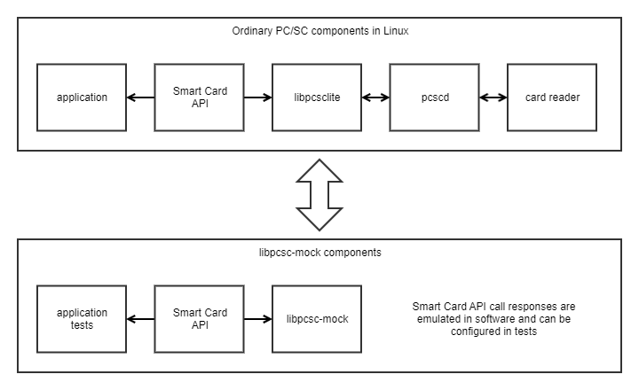

# libpcsc-mock

C++ library for mocking responses to PC/SC smart card API function calls.
Intended to be used in unit tests to emulate complex PC/SC scenarios like
different smart card and reader states and replay of longer APDU
request/response sequences.

## Overview

Here is a visual overview of the library:



Given the system under test uses the PC/SC API, here is an example Google Test
unit test that uses *libpcsc-mock* to mock the response of the
`SCardListReaders` PC/SC call:

```c++
TEST(pcsc_cpp_test, listReadersNoReaders)
{
    PcscMock::addReturnValueForScardFunctionCall("SCardListReaders",
                                                 SCARD_E_NO_READERS_AVAILABLE);

    auto readers = systemUnderTest.listReaders();
    EXPECT_EQ(readers.size(), 0);
}
```

Here is an example test that uses the replay of longer APDU request/response
sequences:

```c++
const PcscMock::ApduScript GET_CERTIFICATE {
    // Select master file.
    {{0x00, 0xa4, 0x00, 0x0c}, {0x90, 0x00}},
    // Select directory.
    {{0x00, 0xa4, 0x01, 0x0c, 0x02, 0xee, 0xee}, {0x90, 0x00}},
    // Select certificate file.
    {{0x00, 0xa4, 0x02, 0x0c, 0x02, 0xaa, 0xce}, {0x90, 0x00}},
    ...
};

TEST(electronic_id_test, selectCertificate)
{
    PcscMock::setApduScript(GET_CERTIFICATE);
    auto certificate = systemUnderTest.getCertificate();
    ...
}
```

You can find more test examples in the
[*libelectronic-id*](https://github.com/web-eid/libelectronic-id/) project
`tests/mock` directory.

## Building

In Ubuntu:

    apt install build-essential pkg-config cmake libgtest-dev valgrind libpcsclite-dev
    sudo bash -c 'cd /usr/src/googletest && cmake . && cmake --build . --target install'
    
    cd build
    cmake .. # optionally with -DCMAKE_BUILD_TYPE=Debug
    cmake --build . # optionally with VERBOSE=1

## Testing

Build as described above, then inside `build` directory:

    ctest # or 'valgrind --leak-check=full ctest'

## Development guidelines

Format code with `scripts/clang-format.sh` before committing.
